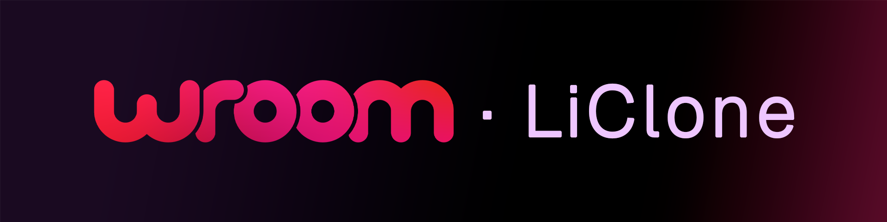
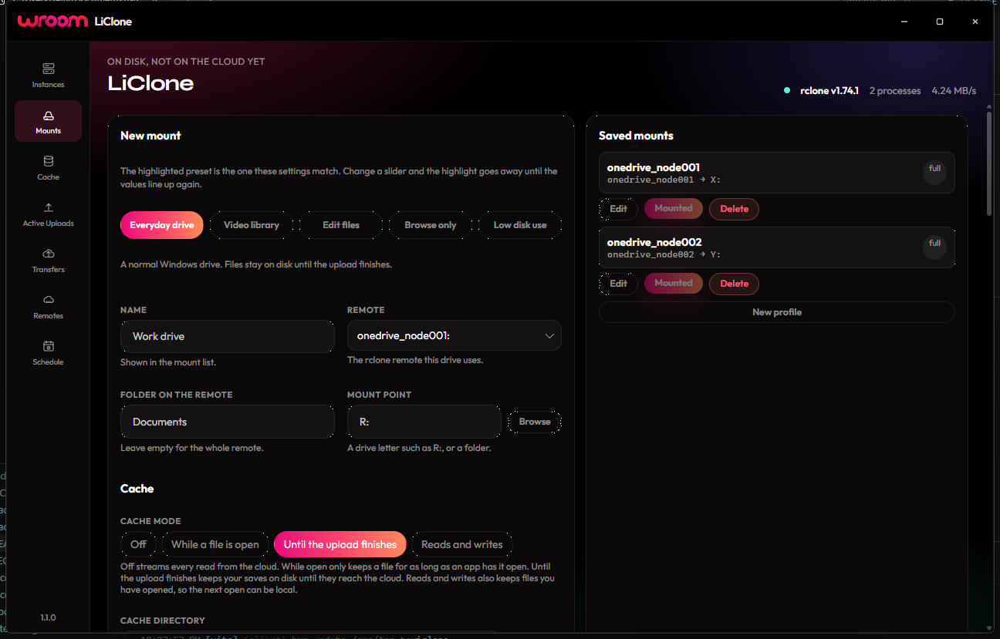
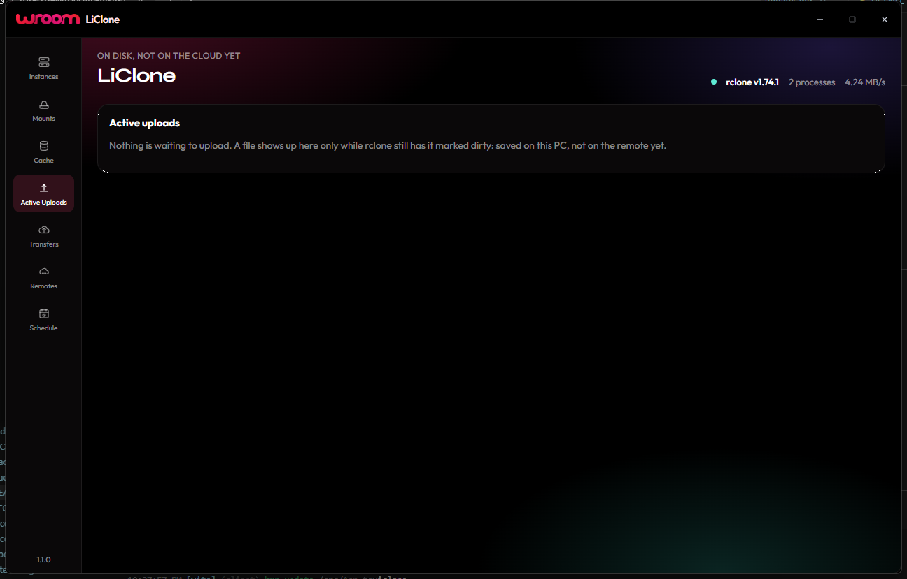

<p align="center">
  
</p>

<p align="center">
  <a href="https://github.com/wroom-tv/LiClone/releases"></a>
  <a href="https://github.com/wroom-tv/LiClone/actions/workflows/ci.yml"></a>
  <a href="https://github.com/wroom-tv/LiClone/releases"></a>
  <a href="LICENSE"></a>
</p>

LiClone is a Windows app for [rclone](https://rclone.org/). It turns a cloud remote into a normal drive, keeps a list of files that still have to upload, and lets you change remotes without opening a terminal.

You use it like any other folder in File Explorer. Copy a file onto the drive and rclone sends it when it can. LiClone shows what is still on this PC, what is uploading now, and what is only waiting. Closing the window leaves LiClone in the tray, and it leaves rclone running, so the drive stays mounted. **Quit** in the tray menu is what exits.

You can use LiClone for personal, work, or commercial use. You can read the source and change it for yourself. Publishing a copy or a changed version needs written permission from Wroom. The full terms are in [LICENSE](LICENSE).

## Install

Download the Windows installer from [Releases](https://github.com/wroom-tv/LiClone/releases). It installs for the current user, shows the license before it copies files, and puts a Start menu shortcut under **Wroom**. An older installer will not replace a newer LiClone.

You need Windows 10 or later. A drive letter also needs [WinFSP](https://winfsp.dev/). rclone and WinFSP are separate projects with their own licenses.

rclone does not have to be installed first. The first time LiClone opens, it asks you to:

1. Read a short welcome.
2. **Install rclone**, if it is not already on this PC. That installs rclone for your user and adds it to your PATH.
3. **Start LiClone when I sign in.** This is on unless you turn it off. LiClone then opens in the tray, with no window in the way.

LiClone is built for rclone 1.65 and newer. If the header says the installed rclone is too old, update rclone before you rely on mounts or remote edits.

## Mounts

A mount is a saved rclone drive. Pick a preset for everyday use, video, editing, browse-only, or low disk use, then change any setting. Each setting has a short explanation. Saved drives are listed beside the form, and a drive that is already running shows **Mounted**.



Each mount gets its own remote-control port, so two drives can run at the same time. You can also take a mount that is already running and save it here.

## Active uploads

**Active uploads** lists every file that is still on this PC and has not finished going to the cloud. That includes files saving to disk, files waiting for a turn, and files rclone is sending now. The list is not cut short.



## Also in the app

- Create and edit rclone remotes, including settings rclone marks as advanced. Passwords stay in rclone’s own config.
- Clear cache only after a preview, and never while a file is still uploading.
- A cache size suggestion for a new mount: 10% of free space on your profile disk, and never more than 100 GB.
- When a newer LiClone is published, the app can install it and restart. If that release cannot read older settings, it installs a compatible stop first.

A walkthrough of each screen is in [Using LiClone](docs/usage.md).

## If something goes wrong

Report a security problem the way [SECURITY.md](SECURITY.md) describes. Do not paste passwords, tokens, or your rclone config into a public issue.

Other bugs and ideas go to [Issues](https://github.com/wroom-tv/LiClone/issues). If you want to send a fix, read [CONTRIBUTING.md](CONTRIBUTING.md) first.

## Build it yourself

You need Node 22 and a stable Rust toolchain.

```bash
npm ci
npm run tauri dev
```

`npm run tauri build` writes the installer to `src-tauri/target/release/bundle`.

## License

[Wroom Source-Available License 1.0](LICENSE). Copyright (c) 2026 Wroom. All rights reserved.
